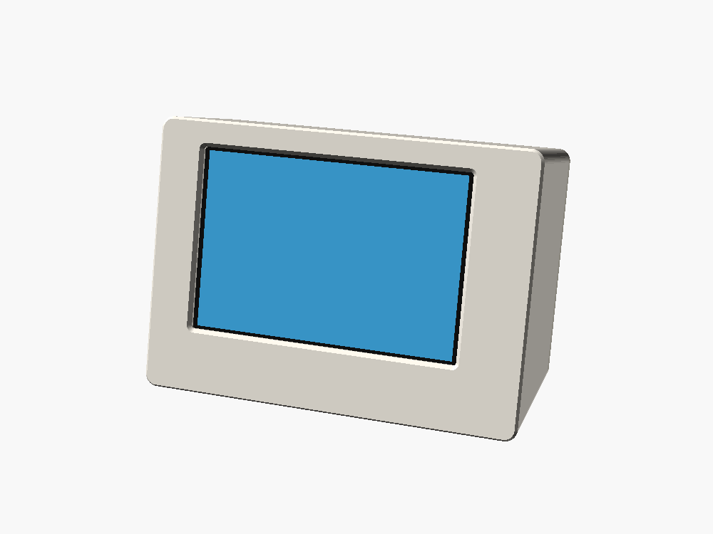
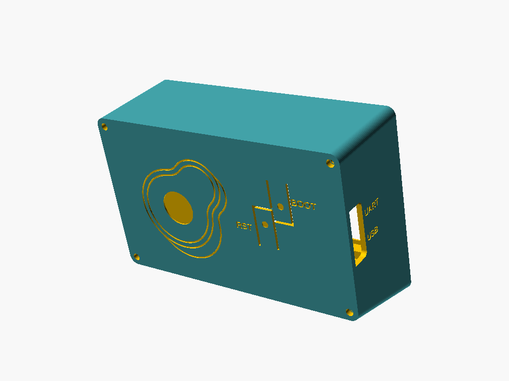
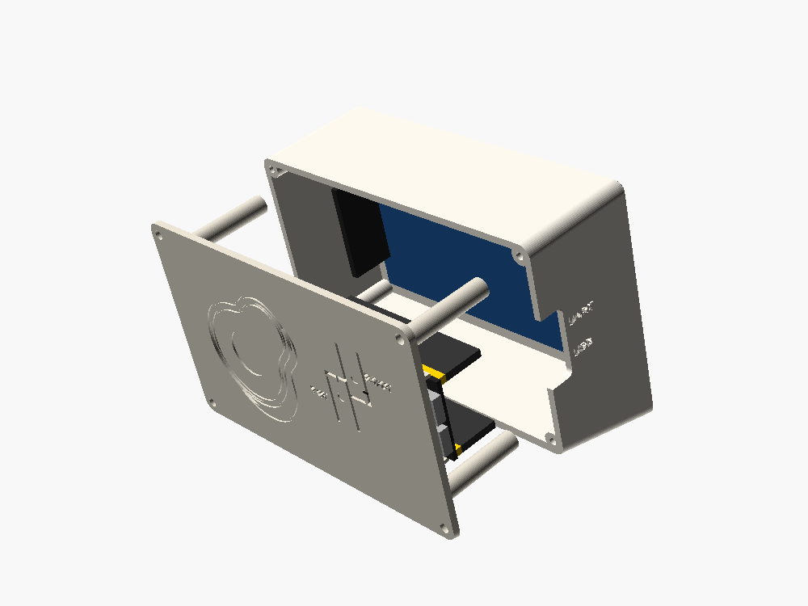
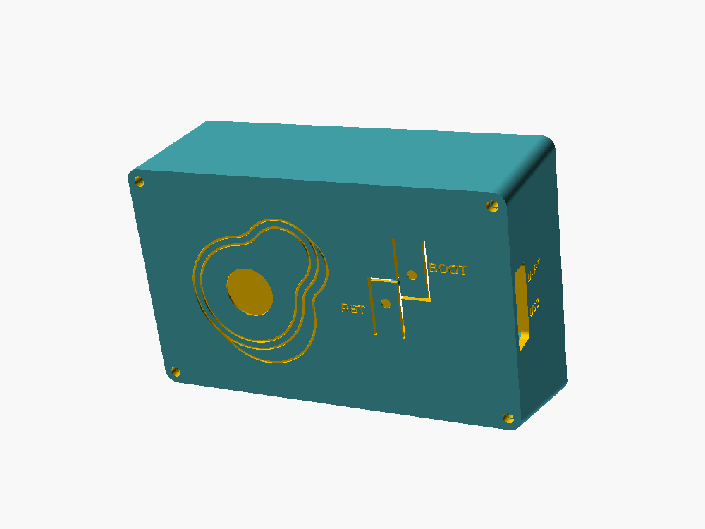
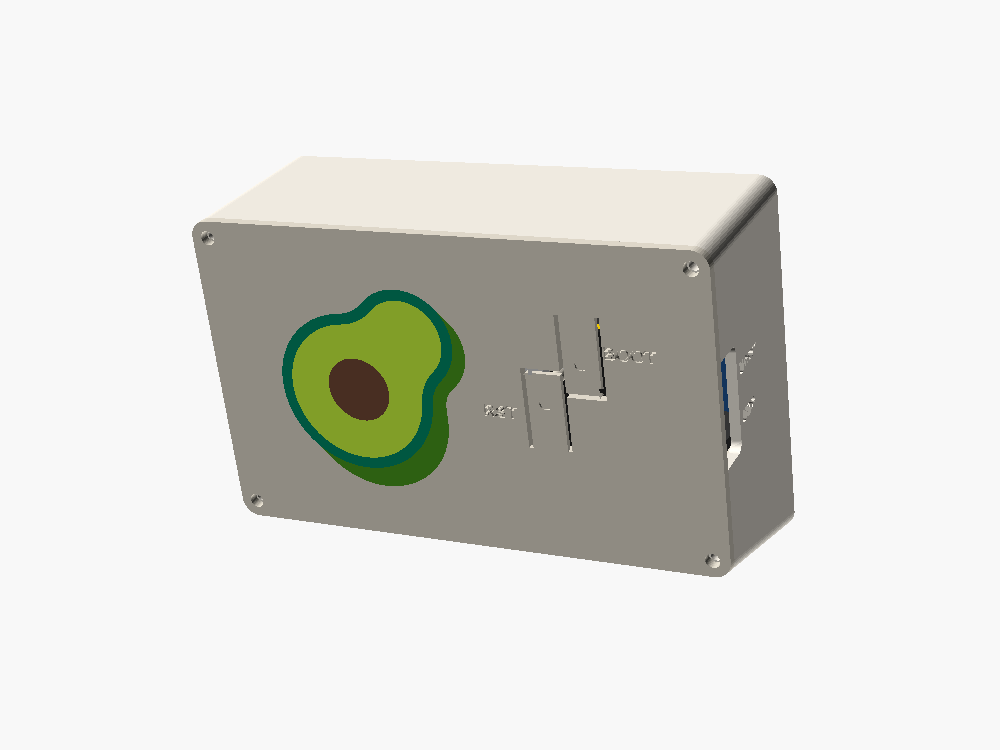
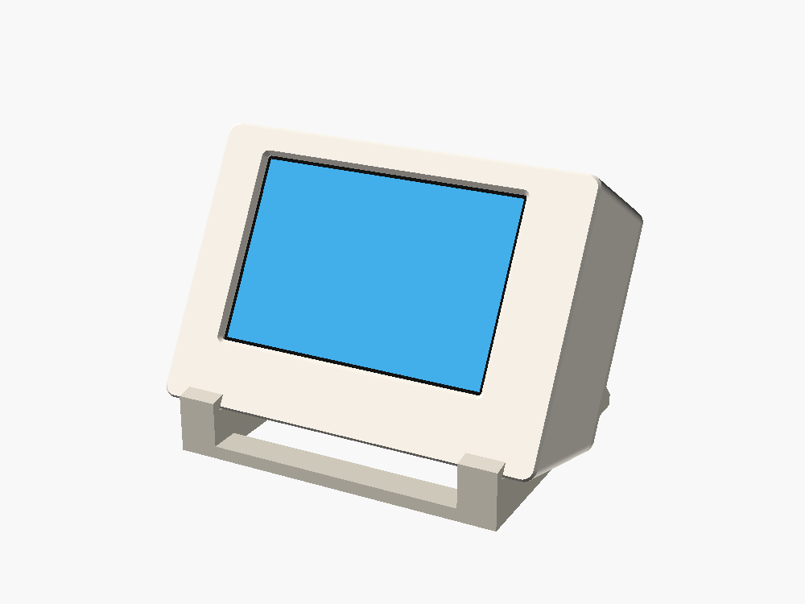
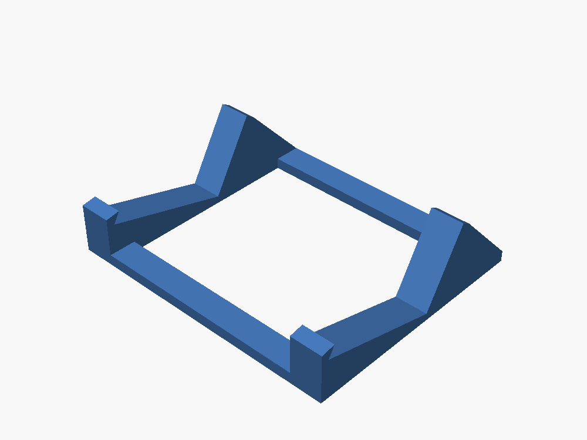

# Desk case: `devkitc_st7796`

A 3D-printable stand for the hand-wired **YD-ESP32-S3 (ESP32-S3-DevKitC-1 clone) +
LCDwiki MSP4031 4.0" ST7796S** build. It's a small monitor shape: the screen
leans back 15°, the ESP32 rides on the back cover, USB-C comes out the left
side, and two flex keys on the back press the board's **BOOT** (screen off/on
on this port) and **RST** buttons.

| Front | Back | Exploded |
|---|---|---|
|  |  |  |

Outer size: **122 × 87 × 45 mm** (W × H × D, including the 12 mm chin the tilt
wedge adds under the screen).

## Parts

| File | What | PLA @ 0.2 mm, 15 % infill |
|---|---|---|
| `stl/fit_test.stl` | Bezel + display pocket only. **Print this first.** | ~20 g |
| `stl/shell.stl` | Front bezel, walls, tilt wedge, screw bosses | ~68 g |
| `stl/lid.stl` | Back cover with the ESP32 cradle, 4 display pushers, BOOT + RST flex keys, engraved avocado | ~29 g |
| `stl/multicolor/` | Same back cover with a full-colour avocado, for a multi-colour printer (see [Back-cover art](#back-cover-art)) | ~30 g |
| `stl/stand_25.stl` / `stand_30.stl` / `stand_35.stl` | Optional stand that reclines the screen to 25°, 30° or 35° (see [Stand](#stand-optional)) | ~20–22 g |

The STLs are already in print orientation (shell and fit test face-down, lid
outer face down, stand upright). **No supports.** PrusaSlicer flags the lid for "long
bridging"; that's the engraved avocado and key dots on its bottom face, and
it prints fine.
Use at least 3 perimeters so the 2.4 mm walls come out solid.

Also needed:

- 4 × M3 × 8–10 mm screws (self-tapping, or ordinary machine screws; they cut their own thread in the 2.6 mm pilots)
- 1 mm double-sided foam tape (for the 4 pusher tips)
- double-sided tape (under the ESP32)

## Measure before you print

The model is built from datasheet dimensions (sources below) and has been
collision-checked in OpenSCAD, but **it hasn't been printed yet**. These are the
numbers most likely to differ on your parts. Check them with calipers:

| Parameter | Default | What it is |
|---|---|---|
| `disp_w` × `disp_h` | 108.00 × 60.88 | Display PCB outline |
| `disp_stack` | 4.2 | Glass + touch panel thickness, from the PCB front face to the front of the glass |
| `aa_left` | 9.36 | Left edge of the lit picture area to the left PCB edge (the edge **away** from the J2 header) |
| `btn_h` | 2.5 | BOOT / RST button height above the ESP32 PCB |
| `wire_space` | 24.5 | Room for the dupont housings + wire bend. Shorter or soldered wiring → set lower for a thinner case |

The **fit test** answers the first three: the display should drop into the
pocket with a little play, and with the screen on, the window edges should
sit just outside the picture on all four sides.

## Changing the model

1. Install [OpenSCAD](https://openscad.org/) (free).
2. Open `clawdmeter_devkitc_st7796.scad`, then **Window → Customizer**.
3. Change values, press **F6** (render), then **F7** (export STL). Set `part` to
   `shell`, `lid`, `fit_test` or `stand` to choose what gets exported;
   `assembly`, `exploded` and `on_stand` are previews with stand-in boards.

Command line:

```bash
openscad -o shell.stl -D 'part="shell"' -D 'tilt=20' clawdmeter_devkitc_st7796.scad
```

Other useful knobs: `tilt` (0 = upright box, no chin), `stand_angle`,
`button_style` (`flex` / `hole` / `none`), `lid_art` / `art_style`, `nub_gap`.

## Assembly

1. **Display:** lay the shell face-down. Drop the display in glass-first, with
   the J2 header on the side **away** from the USB slot.
2. **ESP32:** put double-sided tape on the two small pads in the middle of the
   lid. Press the board in **component side down** (the WROOM module sits on
   the pads), between the two rails, with the USB-C end at the lid edge that
   lines up with the slot. **Push it toward the antenna end until the
   antenna touches the end stop**: that's the position the key nubs are
   lined up for.
3. **Wiring:** same pin map as now (see `firmware/src/boards/devkitc_st7796/board.h`).
   10 cm dupont wires are much easier to fit than 20 cm ones.
4. Stick 1 mm foam tape on each of the 4 pusher tips. They hold the display
   against the bezel.
5. Close the lid over the shell (USB end to the slot side) and fit the 4 screws.
6. Plug in. The port labelled **UART** is the CH343 serial port (flashing,
   serial monitor); **USB** is the S3's native USB. Either one powers it.
7. Test the two keys on the back. Press on the dot, not near the hinge.
   - **BOOT** turns the screen off, and pressing it again turns it back on.
   - **RST** restarts the board: the screen goes dark for a moment, then comes back.

   BOOT and RST are only 5.3 mm apart on the board, so the two keys interlock.
   BOOT's key hangs down from above, RST's comes up from below, and the tips
   meet over the buttons. The dots you press are about 13 mm apart, so one
   finger doesn't hit both.

**If the screen stays dark after closing the lid**, a key nub is holding its
button down: BOOT held at power-up puts the ESP32 into its bootloader, and
RST held keeps it in reset. Raise `nub_gap` (or file that nub down a little)
and reprint the lid. **If a key clicks nothing**, the board has probably slid
away from the end stop, or your buttons are shorter than `btn_h`.

## Back-cover art

The back cover carries the avocado from Microsoft's
[Fluent Emoji](https://github.com/microsoft/fluentui-emoji) set (flat style,
MIT licence; see `art/`). There are two versions:

| Engraved: `stl/lid.stl` | Colour inlay: `stl/multicolor/` |
|---|---|
|  |  |

- **Engraved** (default, any printer). The outer face prints on the bed, so a
  large sunk area would sag. Only the edges between the emoji's colour areas
  are engraved, as 0.8 mm grooves, and only the pit is sunk whole. For colour
  on a single-colour printer, fill the grooves and pit with acrylic paint.
- **Colour inlay** (multi-colour printer, e.g. an AMS). `multicolor/lid.stl`
  has a 0.6 mm pocket shaped like the avocado. The four `inlay_*.stl` pieces
  (back rim, skin, flesh, pit) fill it exactly. Load all five files together
  as **one object with multiple parts** (Bambu Studio / OrcaSlicer / PrusaSlicer
  ask when you load them at once). Keep their positions, and give each inlay
  its own filament:

  | Part | Colour |
  |---|---|
  | `inlay_back.stl` | dark green `#44911B` |
  | `inlay_skin.stl` | green `#008463` |
  | `inlay_flesh.stl` | lime `#C3EF3C` |
  | `inlay_pit.stl` | brown `#6D4534` |

`lid_art = "text"` brings back the engraved "Clawdmeter" (`lid_text`), and
`"none"` leaves the back plain. `art_size`, `art_x` and `art_y` move or resize
the avocado.

## Stand (optional)

| On the stand | Stand |
|---|---|
|  |  |

The case stands on its own at 15°. From a chair the screen is easier to read
leaned back further, so the stand holds it at 25°, 30° or 35°. Pick one STL,
or set `stand_angle` (20–40°) and export `part="stand"` for any other angle.
Footprint is about 104 × 88 mm.

The case drops into a V-shaped seat with its back cover against two uprights,
and a small lip in front of the chin stops it sliding forward. The uprights
stop below the BOOT / RST keys, and the USB-C slot on the left side stays clear.
Nothing screws together: lift the case out to use it without the stand.

- Four small rubber feet under the corners keep it from sliding when you tap
  the screen.
- Pressing **BOOT** or **RST** on the back pushes the case forward and up out
  of the seat. Pinch it instead: thumb on the key, fingers on the front bezel.

The stand was checked in OpenSCAD for clearance against the case at all three
angles. With the display and ESP32 inside, the centre of mass sits about
40 mm inside the footprint at both front and back.

## Sources

- **Avocado:** [microsoft/fluentui-emoji](https://github.com/microsoft/fluentui-emoji),
  `assets/Avocado/Flat/avocado_flat.svg`, MIT licence (`art/LICENSE-fluentui-emoji`).
  `art/avocado_[1-4]_*.svg` are its four colour layers, split out unchanged
  so OpenSCAD can import each one.

- **ESP32 board:** vcc-gnd's metric dimension drawing in
  [vcc-gnd/YD-ESP32-S3](https://github.com/vcc-gnd/YD-ESP32-S3): PCB 57.15 × 27.94 mm,
  63.39 mm including the antenna overhang, rows 25.40 mm apart. BOOT/RST
  positions and the USB-C spacing were measured off the same drawing.
- **Display:** LCDwiki MSP4030/MSP4031 specification: PCB 108.00 × 60.88 mm,
  4 × Ø3.2 mounting holes, active area 83.52 × 55.68 mm. The pushers assume the
  holes sit 3.0 mm in from each edge; they press a ring around each hole.
